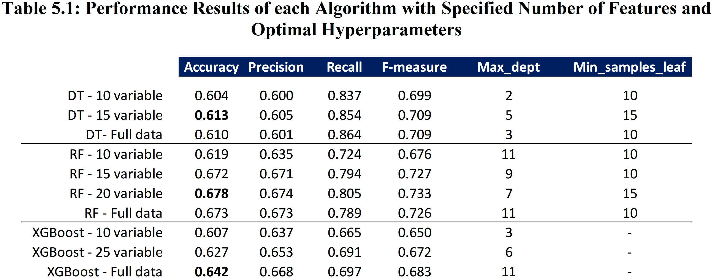
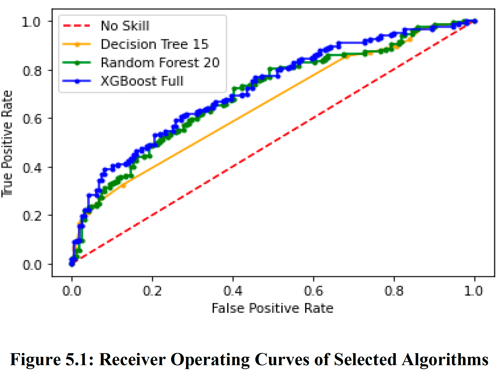

# Myocardial Infarction Prediction using Interpretable Tree-Based Methods

## Problem Description

In this project, I build and compare interpretable tree-based methods for predicting complications of myocardial infarction (i.e., heart attack).

The task is to predict whether the patient will incur a complication or not (binary classification) given the patient's characteristics and to present decision-makers some insights over what features are critical in predicting complications (feature importance).

I apply methods to a publicly available UCI dataset with a size of 1700 patients. The dataset was collected in a clinical hospital in Krasnoyarsk, Russia from 1992-1995. The database contains information about 111 medical features and a binary output representing if a patient with myocardial infarction shows complications or not.

## Data Description

There were several variable categories in the dataset:
- General input values (e.g., ID, age, gender),
- Inputs from anamnesis (e.g., arrhythmia, obesity, bronchial asthma, exertional angina pectoris in the anamnesis),
- Inputs from electrocardiography (e.g., ventricular fibrillation, sinoatrial block on ECG), 
- Inputs from the serum (e.g., serum potassium content, serum sodium content)
- Inputs from intensive care units (e.g., use of liquid nitrates in ICU, use of opioid drugs in the ICU), and
- Results from the emergency cardiology team (e.g., systolic blood pressure, diastolic blood pressure according to the emergency cardiology team).

## Data Preprocessing

I apply the following pre-processing techniques:

- Removing columns/rows with too many missing values
- K-nearest neighbor imputation (binary and continuous variables)
- Most-frequent imputation (categorical variables)
- One-hot encoding (categorical variables)
- Standardization (continuous variables)

## Methodology

Remember that the goal is to present decision-makers insights over what features are important in predicting complications before they occur. Only a few sets of machine learning algorithms can be useful, as most algorithms are not interpretable.

With this goal in mind, I use the following tree-based methods:

- Decision Tree,
- Random forest, and
- XGboost

### Recursive Feature Elimination and Variable Importance

For both decision tree and random forest, I use Recursive Feature Elimination technique to identify the number of features with the best accuracy. Once I find the number of features, I identify the selected features for each algorithm.

For XGBoost algorithm, instead of using recursive elimination, I generate a feature importance graph and identify the most critical features in predicting the complications.

In the end, I identify three feature sets with different number of features for Decision Tree and XGBoost, and four feature sets for Random Forest.

## Results

### Accuracy

The results of each model can be found in Table 5.1, where various indicators showing the performance of each model are tabulated. The models with the highest accuracy scores for each algorithm are highlighted. As can be observed, it is the random forest algorithm with 20 features that gives the best accuracy results.

### ROC Curve

I use Receiver Operating Curve (ROC) graph and Area under the Curve (AUC) metric to compare model performances.

With 0.5 AUC score signifying an algorithm having a 50% chance of distinguishing between classes, it was found that XGboost with all of the features have 0.72 AUC, while random forest with 20 features has 0.70 AUC, followed by 0.65 AUC of simple decision tree with 15 features.

### Feature Importance

The 9 most important features are the same across all algorithms. These features are the following:

- Age
- Serum potassium content (K_BLOOD)
- Serum sodium content (Na_BLOOD)
- Serum A1AT content (ALT_BLOOD)
- Serum AsAT content (AST BLOOD)
- Erythrocyte sedimentation rate (ROE)
- White blood cell count (L_BLOOD) 
- Systolic blood pressure according to intensive care unit (S_AD_ORIT)
- Diastolic blood pressure according to intensive care unit (D_AD_ORIT)

## Limitations and Future Directions

My study had several limitations:

- many missing values in the data (removed features with missing values above a certain threshold.)
- low accuracy (around 65%. I could use non-linear algorithms such as Deep Neural Networks that can increase accuracy at the expense of interpretability)
